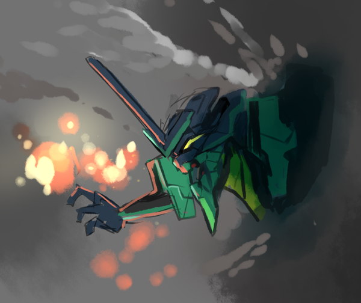
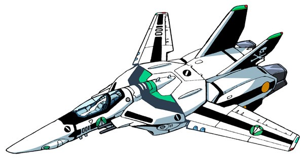
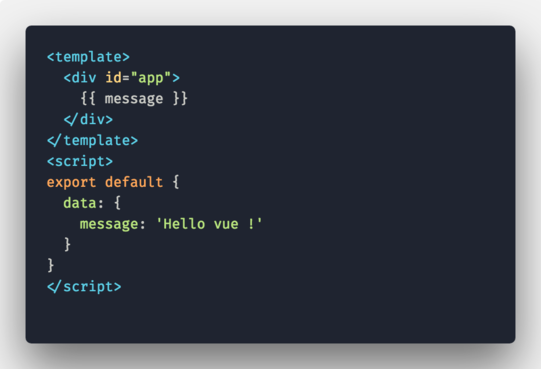

  # Overview ?

 Berawal saat melihat vue merilis versi nya yang terbaru yaitu versi `2.6`, membuat saya berfikir sejenak. ***Oh iya ya kenapa engga buat artikel tentang vue ?*** tetapi tentu saja ada yang membedakan dari content yang saya bahas dengan artikel vue yang lain. Kali ini saya akan membahas apa itu vue, sejarah, contoh penulisan pada vue dan juga kenapa vue disebut sebut sebagai gabungan antara **Angular** dan **React**.

 <!--  -->

> **NOTE** : saya akan membahas sedikit perbandingan antara vue dengan react dan angular , tetapi tidak untuk siapa yang paling hebat.

 # Awal mula ?

 Kemunculan vue pada tahun 2014 mewarnai ekosistem web development khusus nya pada frontend. **Evan You** sang kreator vue yang sebelumnya bekerja di Google dan juga sebelumnya merupakan salah satu bagian dari team Angular. Menurut Evan , **Angular** sangatlah keren karena memberi fitur binding data dan data driven pada DOM yang dapat membantu kita memanipulasi DOM tanpa menyentuh / berinteraksi langsung dengan DOM.

 Tetapi dikarenakan konsep yang dimiliki oleh Angular terlalu complex, lalu Evan berfikir untuk membuat sesuatu yang sangat ringan dan juga tidak banyak konsep tambahan yang diimplementasikan. Akhirnya Evan membuat eksperimen dimana dia mengadopsi beberapa fitur dari Angular seperti Data binding dan dari situlah awal mula vue tercipta. Selain itu vue mengadopsi beberapa potongan fitur dari React seperti Routing, State management, build chain dan CLI react yaitu **react-create-app**.

Setelah beberapa waktu vue berkembang, akhirnya versi 1.0 dirilis dan ada yang unik dari setiap perilisan vue. Yaitu pada codename nya . Dikarenakan sang kreator **Evan** menyukai anime dan sering juga membaca manga, codename pada vue diberi nama dengan judul dari anime. Tidak hanya versi 1.0 yang memiliki codename dari judul anime , versi terbaru pun tetap masih menggunakan codename judul anime yaitu **Macross**.

# Jadi apa itu Vue ?

Secara teknis, vue merupakan framework javascript yang didesign untuk membangun UI ( user interface ). Dibandingkan dengan angular dan react , vue memiliki learning curve yang cukup mudah untuk dipelajari dan digunakan, vue sendiri sekarang telah memiliki star paling banyak di github daripada react dan angular. ***Apakah dengan begitu vue adalah framework js nomer 1 ?*** tentu saja tidak, star yang banyak tersebut dapat menjadi salah satu acuan bahwa vue sangatlah populer di kalangan web developer.

### Contoh binding pada vue

code diatas merupakan contoh binding pada vue , ada yang unik dari kode diatas. Yaitu penulisan vue seperti **HTML-like** , mereka menyebutnya template. Dengan menyatukan view layer HTML dengan logic (pada tag script) di dalam satu file.

# Kesimpulan ?

Dari pembahasan diatas, sekarang kita sudah tau dari mana asal muasal vue dan apa yang membuat **Evan** sang kreator menciptakan vue serta keunikan pada codename dan contoh penulisan kode pada vue. Di artikel selanjutnya kita akan bahas apa itu **template** , **view layer** dan cara menggunakan **vue** secara rinci, ***"See you next time"***.